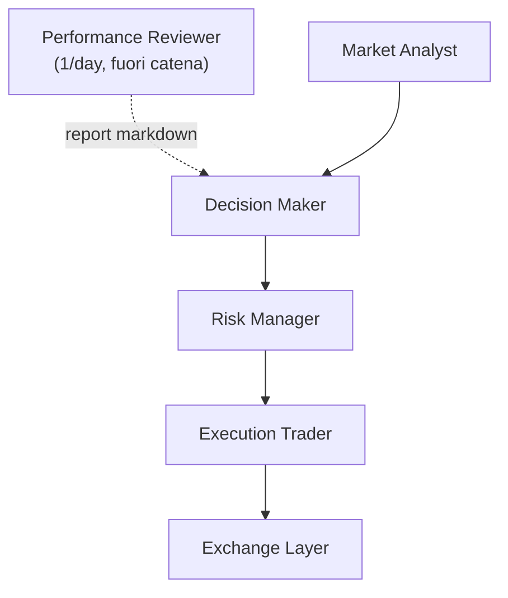

# Architettura

MDK Crypto Trading è progettato come un sistema multi-agente per il trading crypto spot.
L'MVP separa chiaramente analisi, decisione, controllo del rischio ed esecuzione, in modo da evitare che un singolo componente faccia tutto da solo. Un quinto agente consultivo (`Performance Reviewer`) sta fuori dalla catena decisionale e alimenta il Decision Maker con un giudizio giornaliero sulle performance recenti.

---

## 📋 Indice

- [Flusso operativo MVP](#flusso-operativo-mvp)
- [Ruoli degli agenti](#ruoli-degli-agenti)
- [Strati principali](#strati-principali)
- [Contratti condivisi](#contratti-condivisi)
- [Orchestrazione](#orchestrazione)
- [Memoria operativa (MemoryManager)](#memoria-operativa-memorymanager)
- [🔧 Configurazione e prompt](#-configurazione-e-prompt)
- [📚 Riferimenti](#-riferimenti)

---

## Flusso operativo MVP

---

## Ruoli degli agenti

### Market Analyst

- Riceve lo snapshot di mercato completo (prezzo, volume, order book, candele, indicatori tecnici).
- Invia i dati a GPT-5.4 che produce un'analisi strutturata (`MarketAnalysis`).
- Non decide direttamente l'operazione.
- Modello LLM e parametri configurati in `config/llm_models/market_analyst.yaml`.
- Prompt operativo in `config/prompts/market_analyst.md`.

### Decision Maker

- Riceve l'analisi del `Market Analyst`, il portafoglio, i vincoli operativi, la memoria IA, le performance recenti e il report del `Performance Reviewer`.
- Invia i dati a Claude Opus 4.7 con adaptive thinking (`thinking_effort: medium`) che produce una proposta operativa strutturata (`TradeProposal`).
- Azioni possibili: `BUY`, `SELL`, `HOLD`, `CANCEL_AND_REPLACE_ORDER`.
- Non esegue ordini reali.
- Modello LLM e parametri configurati in `config/llm_models/decision_maker.yaml`.
- Prompt operativo in `config/prompts/decision_maker.md`.

### Risk Manager

- Riceve la proposta del `Decision Maker`, il portafoglio, un sottoinsieme dell'analisi di mercato (`market_bias`, `summary`, `risk_notes`), i vincoli operativi e il prezzo corrente.
- Invia i dati a Gemini 3.1 Pro che produce una valutazione strutturata (`RiskAssessment`).
- Decisioni possibili: `APPROVE`, `BLOCK`, `REQUEST_ADJUSTMENT`.
- Non decide la strategia e non esegue ordini.
- Modello LLM e parametri configurati in `config/llm_models/risk_manager.yaml`.
- Prompt operativo in `config/prompts/risk_manager.md`.

### Execution Trader

- Riceve la proposta del `Decision Maker` e l'esito del `Risk Manager`.
- Non usa LLM: esegue ordini direttamente su Binance tramite `BaseExchangeClient`.
- Se la proposta non è approvata o è `HOLD` → `NOT_EXECUTED`.
- Per `BUY`/`SELL` → chiama `place_market_order` o `place_limit_order`.
- Per `CANCEL_AND_REPLACE_ORDER` → chiama `cancel_order` + `place_limit_order`.
- Se l'exchange lancia un'eccezione → `FAILED`.
- Non rivaluta strategia o rischio.

### Performance Reviewer

- Agente consultivo, **fuori dalla catena decisionale**: non valuta né approva i trade del momento.
- Gira una volta al giorno: all'inizio del primo ciclo della giornata, se non esiste già un report per oggi in `data/performance_reports/`.
- Riceve statistiche deterministiche pre-calcolate in Python (`build_performance_stats` su 7 giorni di eventi) + il mandato operativo.
- Invia i dati a Claude Sonnet 4.6 che produce un `PerformanceReview` strutturato (summary, aderenza al mandato `ALIGNED`/`DRIFTING`/`MISALIGNED`, 1-3 suggerimenti concreti).
- Il risultato viene serializzato in markdown in `data/performance_reports/YYYY-MM-DD.md` e letto dal Decision Maker nei cicli successivi (campo `latest_performance_review`).
- Errori del Reviewer sono non-bloccanti: se fallisce, il ciclo prosegue normalmente e il DM riceve stringa vuota.
- Modello LLM e parametri configurati in `config/llm_models/performance_reviewer.yaml`.
- Prompt operativo in `config/prompts/performance_reviewer.md`.

---

## Strati principali

### `src/agents/`

Contiene i 5 agenti del sistema su una gerarchia a due livelli:

- `BaseAgent` (minimale): nome, prompt opzionale, logger, firma astratta di `run`. È estesa direttamente da `ExecutionTraderAgent` (l'unico agente non-LLM).
- `BaseLlmAgent(BaseAgent)` (Template Method): aggiunge `__init__(name, prompt_name, llm)`, un `run` concreto che orchestra il flusso comune (verifica prompt → lettura prompt → costruzione payload → chiamata LLM con retry sul parsing) e `_call_llm_with_retry`. Le sottoclassi LLM implementano solo i metodi astratti `_build_user_payload` (cosa mandare all'LLM) e `_parse_response` (come interpretare la risposta).

Ogni agente espone un input strutturato e un output strutturato.

I 4 agenti operativi (`MarketAnalystAgent`, `DecisionMakerAgent`, `RiskManagerAgent`, `ExecutionTraderAgent`) formano la catena decisionale lineare. `PerformanceReviewerAgent` sta fuori dalla catena e viene invocato solo una volta al giorno dal runner.

`MarketAnalystAgent`, `DecisionMakerAgent`, `RiskManagerAgent` e `PerformanceReviewerAgent` estendono `BaseLlmAgent` e ricevono un `BaseLlmInterface`. Il `run` ereditato dalla base legge il prompt da disco, costruisce il payload tramite `_build_user_payload`, invia i dati al modello e fa retry sul parsing tramite `_call_llm_with_retry` (backoff esponenziale), poi normalizza la risposta tramite `unwrap_llm_response()` e la parsa nei rispettivi contratti (`MarketAnalysis`, `TradeProposal`, `RiskAssessment`, `PerformanceReview`). `ExecutionTraderAgent` non usa LLM: riceve un `BaseExchangeClient` e piazza gli ordini direttamente sull'exchange.

### `src/core/`

- `contracts.py`: strutture dati condivise tra agenti (input, output, enum)
- `exceptions.py`: gerarchia di eccezioni operative del sistema. `MdkTradingError` è la base per tutti gli errori attesi; `ExchangeError(MdkTradingError)` per errori provenienti dall'exchange; `LlmError(MdkTradingError, RuntimeError)` per errori provenienti da un provider LLM. L'ereditarietà multipla di `LlmError` garantisce backward-compatibility con il codice che cattura `RuntimeError`.
- `workflow.py`: catena lineare Market Analyst → Decision Maker → Risk Manager → Execution Trader
- `runner.py`: `TradingRunner`, direttore d'orchestra del loop operativo (loop, segnali, orchestrazione del singolo ciclo). Delega le decisioni specialistiche a 4 collaboratori dedicati:
  - `cycle_skip_handler.py`: `CycleSkipHandler` — possiede lo snapshot del ciclo precedente e il counter dei salti consecutivi, decide se saltare il ciclo (pre-check deterministico)
  - `performance_review_runner.py`: `PerformanceReviewRunner` — esegue il review giornaliero (al massimo una volta al giorno) e legge l'ultimo report markdown
  - `position_manager.py`: `PositionManager` — calcola il P&L non realizzato via FIFO (`augment_portfolio_with_open_position`), sposta automaticamente lo SL al breakeven se le condizioni sono soddisfatte (`maybe_apply_breakeven`) e segnala se un OCO attivo richiede revisione (`is_oco_review_required`)
  - `notifications.py`: funzioni pure che costruiscono i messaggi Telegram (start/stop/error/order), inclusi i dettagli Binance-specific (`cummulativeQuoteQty`/`executedQty`) per il prezzo medio dei MARKET order

### `src/integrations/`

- `llm_interfaces/`: interfaccia astratta (`BaseLlmInterface`) e implementazioni per Anthropic (`AnthropicInterface`), OpenAI (`OpenAiInterface`) e Gemini (`GeminiInterface`), con retry automatico via `tenacity`. Supportano `temperature` e `max_tokens` configurabili. La base usa il pattern **Template Method**: `generate_json` è concreto nella classe base e centralizza retry, controllo risposta vuota, parsing JSON e gestione errori; le sottoclassi implementano solo i metodi astratti specifici del provider (`_call_provider`, `_extract_text`, `_log_empty_response`) e possono fare override dell'hook `_strip_response` (Anthropic lo usa per togliere wrapping markdown). Tutti gli errori sollevati da `generate_json` sono `LlmError` (definito in `src/core/exceptions.py`).
- `exchange/`: interfaccia astratta (`BaseExchangeClient`) e implementazione per Binance (`BinanceClient`), con supporto modalità DEMO e REAL.

`BinanceClient` espone:

- `ping()` / `get_account_info()`: verifica connessione e autenticazione
- `get_market_snapshot(symbol)`: raccoglie prezzo, volume, order book, candele multi-timeframe e fetcha OHLC 1h (60 candele) via `_get_hourly_ohlc`. Il calcolo degli indicatori tecnici (RSI, EMA, SMA, MACD, ATR su serie corrente e precedente) è delegato a `utils/indicators.py::compute_indicators_bundle`, che riceve highs/lows/closes. Gli errori Binance vengono wrappati in `ExchangeError`.
- `get_portfolio_state(symbol)`: raccoglie saldi quote currency e coin, ordini aperti (arricchiti con `age_hours` calcolato dall'helper di modulo `_add_age_to_orders`), ultimi trade. La quote currency (es. USDC) è configurabile in `symbols.yaml` e passata al costruttore. Gli errori Binance vengono wrappati in `ExchangeError`.
- `place_market_order(symbol, side, quantity)`: piazza un ordine a mercato (solo BUY/SELL, altrimenti `ValueError`)
- `place_limit_order(symbol, side, quantity, price)`: piazza un ordine limit GTC (solo BUY/SELL, altrimenti `ValueError`)
- `cancel_order(symbol, order_id)`: cancella un ordine aperto

**Retry policy**: tutti i metodi di `BinanceClient` hanno retry automatico con backoff esponenziale tramite `tenacity` (max 3 tentativi, solo su errori retriabili: `BinanceRequestException`, codici 429/418/5xx).

- I 4 metodi di sola lettura (`ping`, `get_account_info`, `get_market_snapshot`, `get_portfolio_state`) sono retry-safe per natura.
- `cancel_order` è retry-safe perché Binance lo gestisce in modo idempotente: cancellare due volte un ordine già cancellato è innocuo.
- `place_market_order`, `place_limit_order` e `place_oco_sell` generano un UUID (`newClientOrderId` / `listClientOrderId`) prima di chiamare Binance e lo passano all'exchange. Il UUID viene generato nel metodo pubblico (una sola volta) e passato al metodo privato interno che porta il decorator `@_binance_retry`: così tutti i tentativi usano lo stesso identificativo e Binance riconosce la richiesta come duplicato, senza creare un secondo ordine.
- `get_market_snapshot` e `get_portfolio_state` seguono lo stesso pattern a due livelli: il metodo pubblico è un wrapper che cattura le eccezioni Binance e le rilancia come `ExchangeError`; il metodo privato `_*_with_retry` porta il decorator `@_binance_retry` ed esegue la logica effettiva.

### `src/utils/`

- `config.py`: caricamento variabili d'ambiente (`.env`) e file YAML (`trading.yaml`, `symbols.yaml`, configurazioni LLM); include `load_mandate` per parsare l'investment mandate
- `indicators.py`: funzioni pure per RSI, EMA, SMA, MACD e ATR(14) da serie OHLC. `compute_indicators_bundle(closes, *, highs, lows)` produce in un'unica chiamata il dict di 14 chiavi (valore corrente + precedente per ogni indicatore) consumato da `MarketDataSnapshot.indicators`. `highs` e `lows` sono opzionali: se omessi, `atr` e `atr_prev` valgono `None`.
- `logging_config.py`: logging su console (Rich) e su file con rotazione automatica (5 MB, 5 backup)
- `event_logger.py`: log JSON strutturato per le decisioni di ogni ciclo operativo
- `event_log_reader.py`: `load_recent_events` legge i file JSONL degli ultimi N giorni filtrati per simbolo (usato dal Performance Reviewer)
- `memory_manager.py`: persistenza e recupero della memoria operativa del sistema (vedi sotto)
- `performance_stats.py`: `build_performance_stats` calcola in modo deterministico (zero LLM) le statistiche operative degli ultimi N giorni, inclusi `sells_in_profit` e `sells_in_loss` (dalle ultime 10 trade FIFO); `write_performance_report` serializza il giudizio del Reviewer in markdown
- `telegram_notifier.py`: notifiche Telegram opzionali via Bot API — avvio/stop del bot, ordini eseguiti, errori nei cicli

Per i dettagli completi sul sistema di logging, vedi `docs/observability.md`.

---

## Contratti condivisi

Per l'MVP ogni passaggio tra agenti usa strutture dati esplicite.
Questo evita JSON incoerenti sparsi nel codice e rende più facili test, logging e manutenzione.

I contratti principali sono:

- `MarketDataSnapshot`: dati di mercato (prezzo, volume, order book, candele, indicatori)
- `PortfolioState`: saldi, ordini aperti, ultimi trade. Contiene anche tre campi opzionali calcolati a runtime dal runner: `avg_entry_price` (prezzo medio di carico FIFO della posizione aperta), `unrealized_pnl_pct` (P&L non realizzato % al prezzo corrente) e `unrealized_pnl_usdc` (P&L in valore assoluto USDC, calcolato sulla quantità tracciata dal FIFO `open_qty` — non sul saldo totale dell'exchange). Tutti e tre sono `None` se non c'è posizione aperta.
- `MarketAnalysis`: output del `Market Analyst`
- `TradeProposal`: output del `Decision Maker`
- `RiskAssessment`: output del `Risk Manager`
- `ExecutionReport`: output del `Execution Trader`
- `PerformanceStats` / `PerformanceReview`: input/output del `Performance Reviewer`. `PerformanceStats` include ora `sells_in_profit` e `sells_in_loss`: contatori delle ultime 10 SELL FIFO chiuse in profitto/perdita, usati dal Reviewer per valutare la qualità delle uscite.
- `InvestmentMandate`: mandato operativo (caricato da `trading.yaml`)
- `TradingCycleInput` / `TradingCycleResult`: input e output del ciclo completo

---

## Orchestrazione

Il ciclo operativo è gestito da due componenti complementari:

- **`TradingWorkflow`** (`workflow.py`): esegue la catena di agenti in sequenza
- **`TradingRunner`** (`runner.py`): loop infinito che ad ogni iterazione raccoglie dati dall'exchange, esegue il workflow e logga il risultato

Il runner:

1. Logga l'avvio e lo stato del kill switch
2. Ad ogni iterazione: eventualmente genera il report giornaliero (`PerformanceReviewRunner.maybe_run_today`) → raccoglie dati da Binance → **arricchisce il portafoglio** con `avg_entry_price` e `unrealized_pnl_pct` via `PositionManager.augment_portfolio_with_open_position` → eventualmente applica il breakeven automatico via `PositionManager.maybe_apply_breakeven` → eventualmente salta il ciclo via `CycleSkipHandler.try_skip` → legge la memoria storica e l'ultimo report → costruisce `TradingCycleInput` (con `oco_review_required` da `PositionManager.is_oco_review_required`) → esegue il workflow → logga il risultato → salva il ciclo in memoria → registra lo snapshot via `CycleSkipHandler.record_completed_cycle`
3. In caso di errore: il runner distingue due categorie. Errori operativi attesi (`MdkTradingError`, `OSError` — es. exchange offline, LLM sovraccarico): logga, notifica Telegram e **continua il loop**. Bug imprevisti (qualsiasi altra eccezione — es. `AttributeError`, `NameError`): logga, notifica Telegram e **propaga l'eccezione**. `run()` intercetta il bug critico, logga come `CRITICAL`, notifica e termina il processo pulitamente (Docker lo riavvierà).
4. Su `Ctrl+C`: termina in modo pulito

Il punto di ingresso è `src/main.py`, che fa il bootstrap di tutti i componenti (settings, LLM, exchange client, agenti, workflow, memory manager, runner) e avvia il loop.

---

## Memoria operativa (MemoryManager)

`MemoryManager` (`src/utils/memory_manager.py`) permette al sistema di ricordare le decisioni passate e passarle al `Decision Maker` ad ogni ciclo.

### Come funziona

- Dopo ogni ciclo completato con successo, il runner salva un record JSONL in `data/memory/{symbol}.jsonl` con: timestamp, azione, tipo ordine, confidenza, motivazione, quantità, prezzo, stato esecuzione, decisione rischio, bias di mercato.
- Prima di ogni ciclo, il runner legge gli ultimi record e popola tre campi di `TradingCycleInput`:
  - `decision_memory`: ultime 10 decisioni complete
  - `performance_summary`: riassunto testuale delle ultime 10 vendite calcolate con metodo FIFO (profitti/perdite, P&L medio % e P&L totale in USDC)
  - `recent_performance`: ultime 10 decisioni con, per le SELL eseguite, `realized_pnl` (USDC) e `pnl_pct` (%) calcolati con metodo FIFO
- `compute_open_position(symbol)`: calcola la posizione aperta (lotti BUY non ancora venduti) come `{"open_qty": float, "avg_entry_price": float}` usando la coda FIFO residua. Usato dal runner per popolare `PortfolioState.avg_entry_price`, `unrealized_pnl_pct` e `unrealized_pnl_usdc` prima di ogni ciclo. Il P&L in USDC usa `open_qty` (quantità tracciata dal bot) e non il saldo totale dell'exchange, per garantire coerenza: le monete non tracciate dalla memoria FIFO hanno costo di carico ignoto. Se `open_qty` e il saldo exchange divergono oltre l'1%, il runner emette un WARNING diagnostico.

### Cache per-ciclo

Dentro un ciclo il file JSONL è statico (l'unico writer è `save_cycle`, chiamato dopo tutte le letture). `MemoryManager` mantiene due cache interne indicizzate per simbolo: `_records_cache` per i record grezzi (`_read_all`) e `_fifo_cache` per i risultati della camminata FIFO (`_walk_fifo`). Entrambe vengono popolate al primo accesso del ciclo e invalidate da `save_cycle` alla scrittura. Questo riduce le letture da disco e i ricalcoli FIFO da ~5-6 a 1 per ciclo, senza alcun cambio di comportamento osservabile.

### Persistenza

I file `data/memory/` sono esclusi da git (vedi `.gitignore`) e vengono creati automaticamente a runtime. Il `Decision Maker` riceve questi dati come contesto aggiuntivo per prendere decisioni più informate.

---

## 🔧 Configurazione e prompt

- I prompt di lavoro degli agenti vivono in `config/prompts/`.
- I file in `dev_support/prompts/` restano la base di progettazione e riferimento umano.
- Le configurazioni dei modelli LLM (provider, model, temperature, max_tokens) vivono in `config/llm_models/`.
- Il simbolo di trading attivo e la quote currency sono in `config/symbols.yaml`.
- Le regole operative (es. `min_order_usdc`) vivono in `config/trading.yaml`.
- I segreti (API key, URL, modalità) vivono nel `.env`. Le chiavi attive sono `CLAUDE_API_KEY` (Decision Maker + Performance Reviewer), `OPENAI_API_KEY` (Market Analyst) e `GEMINI_API_KEY` (Risk Manager).

Per i dettagli, vedi `docs/config.md`.

---

## 📚 Riferimenti

- **Codice**:
  - `src/agents/` — agenti (Market Analyst, Decision Maker, Risk Manager, Performance Reviewer, Execution Trader) + `BaseAgent` / `BaseLlmAgent`
  - `src/core/contracts.py` — contratti condivisi
  - `src/core/workflow.py` — orchestratore della catena
  - `src/core/runner.py` — loop operativo ciclico
  - `src/integrations/llm_interfaces/` — interfacce LLM (Anthropic, OpenAI, Gemini)
  - `src/integrations/exchange/` — interfaccia exchange (Binance)
  - `src/utils/memory_manager.py` — memoria operativa
  - `src/main.py` — entry point
- **Doc correlati**: `docs/config.md`, `docs/hierarchy_and_roles.md`, `docs/decision_logic.md`, `docs/observability.md`
