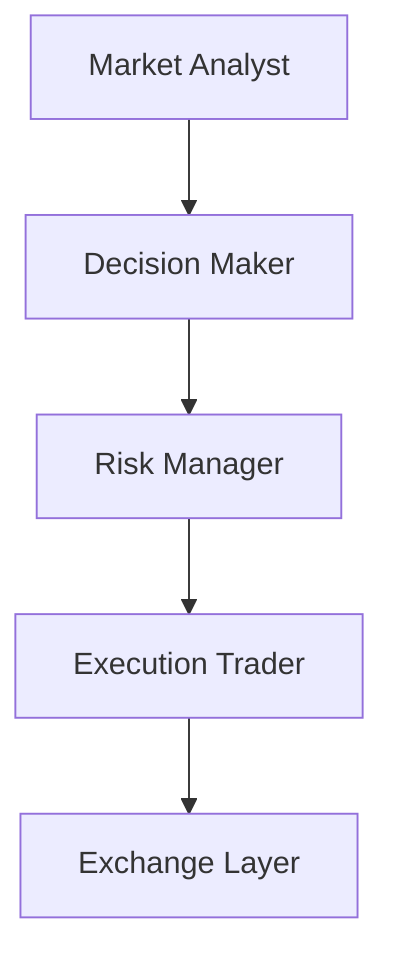

# 🏗️ Architettura

## Obiettivo

MDK Crypto Trading e' progettato come un sistema multi-agente per il trading crypto spot.
L'MVP separa chiaramente analisi, decisione, controllo del rischio ed esecuzione, in modo da evitare che un singolo componente faccia tutto da solo.

## Flusso operativo MVP

## Ruoli degli agenti

### Market Analyst

- Legge i dati di mercato.
- Produce un'analisi strutturata del contesto.
- Non decide direttamente l'operazione.

### Decision Maker

- Riceve l'analisi del `Market Analyst`.
- Formula una proposta operativa.
- Non esegue ordini reali.

### Risk Manager

- Riceve la proposta del `Decision Maker`.
- Verifica vincoli, coerenza e limiti di rischio.
- Può approvare, bloccare o richiedere modifiche.

### Execution Trader

- Riceve proposta ed esito del rischio.
- Esegue solo proposte approvate.
- Non rivaluta strategia o rischio.

## Strati principali

### `src/agents/`

Contiene i 4 agenti dell'MVP e una base comune.
Ogni agente espone un input strutturato e un output strutturato.

### `src/core/`

Contiene i contratti condivisi tra agenti e l'orchestratore del workflow.
Qui vive la sequenza ufficiale del ciclo operativo.

### `src/integrations/`

Contiene le integrazioni verso LLM ed exchange.
In Fase 1 si definiscono solo le basi astratte, senza chiamate reali.

### `src/utils/`

Contiene utility tecniche comuni, come caricamento configurazione e logging.

## Contratti condivisi

Per l'MVP ogni passaggio tra agenti usa strutture dati esplicite.
Questo evita JSON incoerenti sparsi nel codice e rende piu' facili test, logging e manutenzione.

I contratti minimi previsti sono:

- `MarketAnalysis`: output del `Market Analyst`
- `TradeProposal`: output del `Decision Maker`
- `RiskAssessment`: output del `Risk Manager`
- `ExecutionReport`: output del `Execution Trader`

## Orchestrazione

Un orchestratore centrale governa il ciclo operativo.
Nel workflow MVP la sequenza e' fissa:

1. raccolta dei dati necessari
2. esecuzione del `Market Analyst`
3. esecuzione del `Decision Maker`
4. esecuzione del `Risk Manager`
5. esecuzione del `Execution Trader`

## Configurazione e prompt

- I prompt di lavoro degli agenti vivranno in `config/prompts/`.
- I file in `dev_support/prompts/` restano la base di progettazione e riferimento umano.
- Le regole operative del sistema vivranno in `config/`, separate dai segreti presenti nel file `.env`.

## Confini della Fase 1

In questa fase vengono definiti:

- struttura dei moduli
- interfacce e classi base
- contratti condivisi
- orchestratore minimo

In questa fase non vengono ancora implementati:

- chiamate reali a Binance
- chiamate reali ai provider LLM
- logica completa di trading
- gestione completa della configurazione runtime
