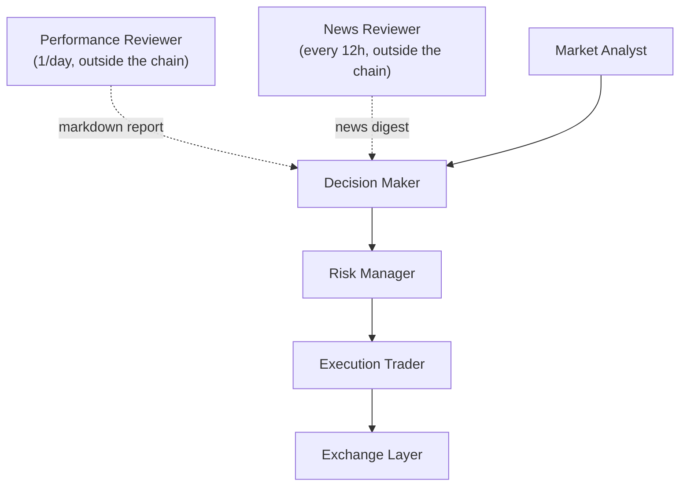

# Architecture

MDK Crypto Trading is designed as a multi-agent system for crypto spot trading.
The MVP clearly separates analysis, decision, risk control and execution, so that no single component does everything on its own. A fifth advisory agent (`Performance Reviewer`) sits outside the decision chain and feeds the Decision Maker with a daily assessment of recent performance.

---

## 📋 Table of Contents

- [MVP operational flow](#mvp-operational-flow)
- [Agent roles](#agent-roles)
- [Main layers](#main-layers)
- [Shared contracts](#shared-contracts)
- [Orchestration](#orchestration)
- [Operational memory (MemoryManager)](#operational-memory-memorymanager)
- [🔧 Configuration and prompts](#-configuration-and-prompts)
- [📚 References](#-references)

---

## MVP operational flow

---

## Agent roles

### Market Analyst

- Receives the full market snapshot (price, volume, order book, candles, technical indicators).
- Sends the data to GPT-5.6 Terra, which produces a structured analysis (`MarketAnalysis`).
- Does not decide the trade directly.
- LLM model and parameters configured in `config/llm_models/market_analyst.yaml`.
- Operational prompt in `config/prompts/market_analyst.md`.

### Decision Maker

- Receives the `Market Analyst`'s analysis, the portfolio, the operational constraints, the AI memory, recent performance and the `Performance Reviewer`'s report.
- Sends the data to Claude Opus 5 with adaptive thinking (`thinking_effort: medium`), which produces a structured trade proposal (`TradeProposal`).
- Possible actions: `BUY`, `SELL`, `HOLD`, `CANCEL_AND_REPLACE_ORDER`.
- Does not execute real orders.
- LLM model and parameters configured in `config/llm_models/decision_maker.yaml`.
- Operational prompt in `config/prompts/decision_maker.md`.

### Risk Manager

- Receives the `Decision Maker`'s proposal, the portfolio, a subset of the market analysis (`market_bias`, `summary`, `risk_notes`), the operational constraints and the current price.
- Sends the data to Gemini 3.7 Flash, which produces a structured assessment (`RiskAssessment`).
- Possible decisions: `APPROVE`, `BLOCK`, `REQUEST_ADJUSTMENT`.
- Does not decide the strategy and does not execute orders.
- LLM model and parameters configured in `config/llm_models/risk_manager.yaml`.
- Operational prompt in `config/prompts/risk_manager.md`.

### Execution Trader

- Receives the `Decision Maker`'s proposal and the `Risk Manager`'s outcome.
- Does not use an LLM: executes orders directly on Binance via `BaseExchangeClient`.
- If the proposal is not approved or is `HOLD` → `NOT_EXECUTED`.
- For `BUY`/`SELL` → calls `place_market_order` or `place_limit_order`.
- For `CANCEL_AND_REPLACE_ORDER` → calls `cancel_order` + `place_limit_order`.
- If the exchange raises an exception → `FAILED`.
- Does not re-evaluate strategy or risk.

### News Reviewer

- Advisory agent, **outside the decision chain**: does not evaluate or approve the current trade.
- Invoked by the runner every 12 hours via `NewsReviewRunner.maybe_run()` (gate based on the latest report file in `data/news_reports/`): if 12 hours have not yet passed since the last report, the cycle proceeds without calling it.
- Receives a `NewsReviewerInput` (symbol, list of `NewsArticle`, time window in hours) produced by `AlphaVantageClient`.
- Sends the data to Claude Sonnet 5, which produces a structured `NewsDigest` (overall_sentiment `BULLISH`/`BEARISH`/`NEUTRAL`, summary, key_events, risk_flags).
- The digest is serialized to markdown in `data/news_reports/YYYY-MM-DD_HH-MM.md`.
- If there are no articles → writes a `NEUTRAL` report without calling the LLM.
- Client or LLM errors are non-blocking: the cycle proceeds normally.
- The digest is read by the Decision Maker on every cycle via the `latest_news_review` field in `DecisionMakerInput`: the loop is closed.
- LLM model and parameters configured in `config/llm_models/news_reviewer.yaml`.
- Operational prompt in `config/prompts/news_reviewer.md`.

### Performance Reviewer

- Advisory agent, **outside the decision chain**: does not evaluate or approve the current trade.
- Runs once a day: at the start of the first cycle of the day, if a report for today does not already exist in `data/performance_reports/`.
- Receives deterministic statistics pre-computed in Python (`build_performance_stats` over 7 days of events) + the operational mandate.
- Sends the data to Claude Sonnet 5, which produces a structured `PerformanceReview` (summary, mandate adherence `ALIGNED`/`DRIFTING`/`MISALIGNED`, 1-3 concrete suggestions).
- The result is serialized to markdown in `data/performance_reports/YYYY-MM-DD.md` and read by the Decision Maker in the following cycles (`latest_performance_review` field).
- Reviewer errors are non-blocking: if it fails, the cycle proceeds normally and the DM receives an empty string.
- LLM model and parameters configured in `config/llm_models/performance_reviewer.yaml`.
- Operational prompt in `config/prompts/performance_reviewer.md`.

---

## Main layers

### `src/agents/`

Contains the system's 5 agents in a two-level hierarchy:

- `BaseAgent` (minimal): name, optional prompt, logger, abstract `run` signature. Extended directly by `ExecutionTraderAgent` (the only non-LLM agent).
- `BaseLlmAgent(BaseAgent)` (Template Method): adds `__init__(name, prompt_name, llm)`, a concrete `run` that orchestrates the common flow (prompt check → prompt reading → payload construction → LLM call with retry on parsing) and `_call_llm_with_retry`. LLM subclasses only implement the abstract methods `_build_user_payload` (what to send to the LLM) and `_parse_response` (how to interpret the response).

Each agent exposes a structured input and a structured output.

The 4 operational agents (`MarketAnalystAgent`, `DecisionMakerAgent`, `RiskManagerAgent`, `ExecutionTraderAgent`) form the linear decision chain. `PerformanceReviewerAgent` sits outside the chain and is invoked only once a day by the runner. `NewsReviewerAgent` is also outside the chain and is invoked every 12 hours by the runner via `NewsReviewRunner`; its reports are read by the Decision Maker in the following cycles (`latest_news_review` field).

`MarketAnalystAgent`, `DecisionMakerAgent`, `RiskManagerAgent` and `PerformanceReviewerAgent` extend `BaseLlmAgent` and receive a `BaseLlmInterface`. The `run` method inherited from the base reads the prompt from disk, builds the payload via `_build_user_payload`, sends the data to the model and retries on parsing via `_call_llm_with_retry` (exponential backoff), then normalizes the response via `unwrap_llm_response()` and parses it into the respective contracts (`MarketAnalysis`, `TradeProposal`, `RiskAssessment`, `PerformanceReview`). `ExecutionTraderAgent` does not use an LLM: it receives a `BaseExchangeClient` and places orders directly on the exchange.

### `src/core/`

- `contracts.py`: data structures shared between agents (input, output, enums). Now includes `NewsSentiment` (enum BULLISH/BEARISH/NEUTRAL, decoupled from `MarketBias`), `NewsDigest` (News Reviewer output) and `NewsReviewerInput` (News Reviewer input).
- `exceptions.py`: the system's operational exception hierarchy. `MdkTradingError` is the base for all expected errors; `ExchangeError(MdkTradingError)` for errors coming from the exchange; `LlmError(MdkTradingError, RuntimeError)` for errors coming from an LLM provider; `NewsError(MdkTradingError)` for errors coming from the news source. `LlmError`'s multiple inheritance ensures backward compatibility with code that catches `RuntimeError`.
- `workflow.py`: linear chain Market Analyst → Decision Maker → Risk Manager → Execution Trader
- `runner.py`: `TradingRunner`, the conductor of the operational loop (loop, signals, single-cycle orchestration). Delegates specialized decisions to 4 dedicated collaborators:
  - `cycle_skip_handler.py`: `CycleSkipHandler` — holds the previous cycle's snapshot and the consecutive-skip counter, decides whether to skip the cycle (deterministic pre-check)
  - `performance_review_runner.py`: `PerformanceReviewRunner` — runs the daily review (at most once a day) and reads the latest markdown report
  - `news_review_runner.py`: `NewsReviewRunner` — runs the news review every 12 hours (gate on `YYYY-MM-DD_HH-MM.md` files in `data/news_reports/`), writes the digest, handles the "no articles" case → `NEUTRAL` without an LLM, is non-blocking; exposes `load_latest_review()` read by the Decision Maker (`latest_news_review`)
  - `position_manager.py`: `PositionManager` — computes unrealized P&L via FIFO (`augment_portfolio_with_open_position`), automatically moves the SL to breakeven when conditions are met (`maybe_apply_breakeven`) and flags whether an active OCO requires review (`is_oco_review_required`)
  - `notifications.py`: pure functions that build Telegram messages (start/stop/error/order), including Binance-specific details (`cummulativeQuoteQty`/`executedQty`) for the average price of MARKET orders

### `src/integrations/`

- `llm_interfaces/`: abstract interface (`BaseLlmInterface`) and implementations for Anthropic (`AnthropicInterface`), OpenAI (`OpenAiInterface`) and Gemini (`GeminiInterface`), with automatic retry via `tenacity`. They support configurable `temperature` and `max_tokens`. The base uses the **Template Method** pattern: `generate_json` is concrete in the base class and centralizes retry, empty-response checking, JSON parsing and error handling; subclasses only implement the provider-specific abstract methods (`_call_provider`, `_extract_text`, `_log_empty_response`) and can override the `_strip_response` hook (Anthropic uses it to strip markdown wrapping). All errors raised by `generate_json` are `LlmError` (defined in `src/core/exceptions.py`).
- `exchange/`: abstract interface (`BaseExchangeClient`), Binance implementation (`BinanceClient`) with DEMO and REAL mode support, and `order_fields.py` as the single source of truth for Binance order field names (used by `BinanceClient`, `PositionManager`, `ExecutionTrader` and `CycleSkipHandler`).
- `news/`: abstract interface (`BaseNewsClient`) with a single method `get_recent_news() -> list[NewsArticle]` and the `AlphaVantageClient` implementation. Downloads crypto news with sentiment from Alpha Vantage (`NEWS_SENTIMENT`), handles the `200` response with an error payload quirk, retries on transient errors via `tenacity`. Used by `NewsReviewRunner` on every cycle (every 12h): `build_runner` constructs it if `ALPHA_VANTAGE_API_KEY` is present and passes it to `TradingRunner`.

`BinanceClient` exposes:

- `ping()` / `get_account_info()`: connection and authentication check
- `get_market_snapshot(symbol)`: collects price, volume, order book, multi-timeframe candles and fetches 1h OHLC (60 candles) via `_get_hourly_ohlc`. The computation of technical indicators (RSI, EMA, SMA, MACD, ATR on the current and previous series) is delegated to `utils/indicators.py::compute_indicators_bundle`, which receives highs/lows/closes. Binance errors are wrapped in `ExchangeError`.
- `get_portfolio_state(symbol)`: collects quote-currency and coin balances, open orders (enriched with `age_hours` computed by the module helper `_add_age_to_orders`), latest trades. The quote currency (e.g. USDC) is configurable in `symbols.yaml` and passed to the constructor. Binance errors are wrapped in `ExchangeError`.
- `place_market_order(symbol, side, quantity)`: places a market order (BUY/SELL only, otherwise `ValueError`)
- `place_limit_order(symbol, side, quantity, price)`: places a GTC limit order (BUY/SELL only, otherwise `ValueError`)
- `cancel_order(symbol, order_id)`: cancels an open order

**Retry policy**: all `BinanceClient` methods have automatic retry with exponential backoff via `tenacity` (max 3 attempts, only on retryable errors: `BinanceRequestException`, codes 429/418/5xx).

- The 4 read-only methods (`ping`, `get_account_info`, `get_market_snapshot`, `get_portfolio_state`) are retry-safe by nature.
- `cancel_order` is retry-safe because Binance handles it idempotently: cancelling an already-cancelled order twice is harmless.
- `place_market_order`, `place_limit_order` and `place_oco_sell` generate a UUID (`newClientOrderId` / `listClientOrderId`) before calling Binance and pass it to the exchange. The UUID is generated in the public method (only once) and passed to the internal private method carrying the `@_binance_retry` decorator: this way all attempts use the same identifier and Binance recognizes the request as a duplicate, without creating a second order.
- `get_market_snapshot` and `get_portfolio_state` follow the same two-level pattern: the public method is a wrapper that catches Binance exceptions and re-raises them as `ExchangeError`; the private `_*_with_retry` method carries the `@_binance_retry` decorator and executes the actual logic.

### `src/utils/`

- `config.py`: loading of environment variables (`.env`) and YAML files (`trading.yaml`, `symbols.yaml`, LLM configurations); includes `load_mandate` for parsing the investment mandate
- `indicators.py`: pure functions for RSI, EMA, SMA, MACD and ATR(14) from OHLC series. `compute_indicators_bundle(closes, *, highs, lows)` produces in a single call the 14-key dict (current + previous value for each indicator) consumed by `MarketDataSnapshot.indicators`. `highs` and `lows` are optional: if omitted, `atr` and `atr_prev` are `None`.
- `logging_config.py`: logging to console (Rich) and to file with automatic rotation (5 MB, 5 backups)
- `event_logger.py`: structured JSON logging for each operational cycle's decisions
- `event_log_reader.py`: `load_recent_events` reads the JSONL files of the last N days filtered by symbol (used by the Performance Reviewer)
- `memory_manager.py`: persistence and retrieval of the system's operational memory (see below)
- `performance_stats.py`: `build_performance_stats` deterministically computes (zero LLM) the operational statistics of the last N days, including `sells_in_profit` and `sells_in_loss` (from the last 10 FIFO trades); `write_performance_report` serializes the Reviewer's assessment to markdown
- `news_report.py`: `write_news_report` serializes a `NewsDigest` to markdown (`YYYY-MM-DD_HH-MM.md`, Windows-safe) and saves it in `data/news_reports/`
- `telegram_notifier.py`: optional Telegram notifications via the Bot API — bot start/stop, executed orders, cycle errors

For full details on the logging system, see `docs/observability.md`.

---

## Shared contracts

For the MVP, every handoff between agents uses explicit data structures.
This avoids inconsistent JSON scattered across the code and makes testing, logging and maintenance easier.

The main contracts are:

- `MarketDataSnapshot`: market data (price, volume, order book, candles, indicators)
- `PortfolioState`: balances, open orders, latest trades. Also contains three optional fields computed at runtime by the runner: `avg_entry_price` (FIFO average entry price of the open position), `unrealized_pnl_pct` (unrealized P&L % at the current price) and `unrealized_pnl_usdc` (P&L in absolute USDC, computed on the quantity tracked by the FIFO `open_qty` — not on the exchange's total balance). All three are `None` if there is no open position.
- `MarketAnalysis`: `Market Analyst` output
- `TradeProposal`: `Decision Maker` output
- `RiskAssessment`: `Risk Manager` output
- `ExecutionReport`: `Execution Trader` output
- `PerformanceStats` / `PerformanceReview`: `Performance Reviewer` input/output. `PerformanceStats` now includes `sells_in_profit` and `sells_in_loss`: counters of the last 10 FIFO SELLs closed in profit/loss, used by the Reviewer to assess exit quality.
- `NewsReviewerInput` / `NewsDigest`: `News Reviewer` input and output. `NewsDigest` contains `overall_sentiment` (`NewsSentiment`: BULLISH/BEARISH/NEUTRAL), `summary`, `key_events` and `risk_flags`. The serialized digest is read by the runner as `latest_news_review` and passed to `DecisionMakerInput`.
- `InvestmentMandate`: operational mandate (loaded from `trading.yaml`)
- `TradingCycleInput` / `TradingCycleResult`: input and output of the full cycle

---

## Orchestration

The operational cycle is managed by two complementary components:

- **`TradingWorkflow`** (`workflow.py`): executes the agent chain in sequence
- **`TradingRunner`** (`runner.py`): infinite loop that, on every iteration, collects data from the exchange, runs the workflow and logs the result

The runner:

1. Logs the startup and kill switch status
2. On every iteration: optionally generates the daily report (`PerformanceReviewRunner.maybe_run_today`) → optionally generates the news digest (`NewsReviewRunner.maybe_run`, gated every 12h) → collects data from Binance → **enriches the portfolio** with `avg_entry_price` and `unrealized_pnl_pct` via `PositionManager.augment_portfolio_with_open_position` → optionally applies automatic breakeven via `PositionManager.maybe_apply_breakeven` → optionally skips the cycle via `CycleSkipHandler.try_skip` → reads historical memory and the latest report → builds `TradingCycleInput` (with `oco_review_required` from `PositionManager.is_oco_review_required`) → runs the workflow → logs the result → saves the cycle to memory → records the snapshot via `CycleSkipHandler.record_completed_cycle`
3. On error: the runner distinguishes two categories. Expected operational errors (`MdkTradingError`, `OSError` — e.g. exchange offline, LLM overloaded): logs, notifies via Telegram and **continues the loop**. Unexpected bugs (any other exception — e.g. `AttributeError`, `NameError`): logs, notifies via Telegram and **propagates the exception**. `run()` catches the critical bug, logs it as `CRITICAL`, notifies and cleanly terminates the process (Docker will restart it).
4. On `Ctrl+C`: terminates cleanly

The entry point is `src/main.py`: `main()` loads the settings with `load_settings()`, delegates the bootstrap to `build_runner(settings)` (which assembles the LLM client, exchange client, agents, workflow, memory manager and runner) and calls `runner.run()`.

---

## Operational memory (MemoryManager)

`MemoryManager` (`src/utils/memory_manager.py`) allows the system to remember past decisions and pass them to the `Decision Maker` on every cycle.

### How it works

- After every successfully completed cycle, the runner saves a JSONL record in `data/memory/{symbol}.jsonl` with: timestamp, action, order type, confidence, reasoning, quantity, price, execution status, risk decision, market bias.
- Before every cycle, the runner reads the latest records and populates three fields of `TradingCycleInput`:
  - `decision_memory`: last 10 full decisions
  - `performance_summary`: textual summary of the last 10 sells computed with the FIFO method (profits/losses, average P&L % and total P&L in USDC)
  - `recent_performance`: last 10 decisions with, for executed SELLs, `realized_pnl` (USDC) and `pnl_pct` (%) computed with the FIFO method
- `compute_open_position(symbol)`: computes the open position (BUY lots not yet sold) as `{"open_qty": float, "avg_entry_price": float}` using the remaining FIFO queue. Used by the runner to populate `PortfolioState.avg_entry_price`, `unrealized_pnl_pct` and `unrealized_pnl_usdc` before every cycle. The P&L in USDC uses `open_qty` (the quantity tracked by the bot), not the exchange's total balance, to ensure consistency: coins not tracked by the FIFO memory have an unknown cost basis. If `open_qty` and the exchange balance diverge by more than 1%, the runner emits a diagnostic WARNING.

### Per-cycle cache

Within a cycle, the JSONL file is static (the only writer is `save_cycle`, called after all reads). `MemoryManager` maintains two internal caches indexed by symbol: `_records_cache` for raw records (`_read_all`) and `_fifo_cache` for the results of the FIFO walk (`_walk_fifo`). Both are populated on the first access of the cycle and invalidated by `save_cycle` on write. This reduces disk reads and FIFO recalculations from ~5-6 to 1 per cycle, with no observable change in behavior.

### Persistence

The `data/memory/` files are excluded from git (see `.gitignore`) and are created automatically at runtime. The `Decision Maker` receives this data as additional context for making more informed decisions.

---

## 🔧 Configuration and prompts

- The agents' working prompts live in `config/prompts/`.
- LLM model configurations (provider, model, temperature/reasoning_effort/thinking_effort, max_tokens) live in `config/llm_models/`.
- The active trading symbol and quote currency are in `config/symbols.yaml`.
- Operational rules (e.g. `min_order_usdc`) live in `config/trading.yaml`.
- Secrets (API keys, URLs, mode) live in `.env`. The active keys are `CLAUDE_API_KEY` (Decision Maker + Performance Reviewer), `OPENAI_API_KEY` (Market Analyst) and `GEMINI_API_KEY` (Risk Manager).

For details, see `docs/config.md`.

---

## 📚 References

- **Code**:
  - `src/agents/` — agents (Market Analyst, Decision Maker, Risk Manager, Performance Reviewer, Execution Trader) + `BaseAgent` / `BaseLlmAgent`
  - `src/core/contracts.py` — shared contracts
  - `src/core/workflow.py` — chain orchestrator
  - `src/core/runner.py` — cyclical operational loop
  - `src/integrations/llm_interfaces/` — LLM interfaces (Anthropic, OpenAI, Gemini)
  - `src/integrations/exchange/` — exchange interface (Binance)
  - `src/utils/memory_manager.py` — operational memory
  - `src/main.py` — entry point
- **Related docs**: `docs/config.md`, `docs/hierarchy_and_roles.md`, `docs/decision_logic.md`, `docs/observability.md`
