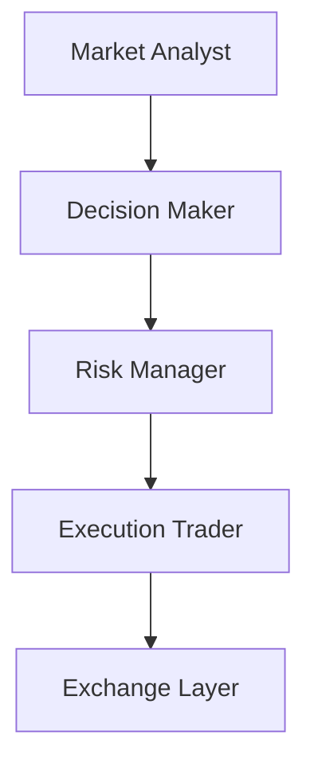

# 🏗️ Architettura

MDK Crypto Trading è progettato come un sistema multi-agente per il trading crypto spot.
L'MVP separa chiaramente analisi, decisione, controllo del rischio ed esecuzione, in modo da evitare che un singolo componente faccia tutto da solo.

## Flusso operativo MVP

## Ruoli degli agenti

### Market Analyst

- Legge i dati di mercato.
- Produce un'analisi strutturata del contesto.
- Non decide direttamente l'operazione.

### Decision Maker

- Riceve l'analisi del `Market Analyst`.
- Formula una proposta operativa.
- Non esegue ordini reali.

### Risk Manager

- Riceve la proposta del `Decision Maker`.
- Verifica vincoli, coerenza e limiti di rischio.
- Può approvare, bloccare o richiedere modifiche.

### Execution Trader

- Riceve proposta ed esito del rischio.
- Esegue solo proposte approvate.
- Non rivaluta strategia o rischio.

## Strati principali

### `src/agents/`

Contiene i 4 agenti dell'MVP e una base comune.
Ogni agente espone un input strutturato e un output strutturato.

### `src/core/`

Contiene i contratti condivisi tra agenti e l'orchestratore del workflow.
Qui vive la sequenza ufficiale del ciclo operativo.

### `src/integrations/`

Contiene le integrazioni verso LLM ed exchange.

- `llm_interfaces/`: interfaccia astratta (`BaseLlmInterface`) e implementazioni concrete per OpenAI (`OpenAiInterface`) e Gemini (`GeminiInterface`), con retry automatico via `tenacity`.
- `exchange/`: interfaccia astratta (`BaseExchangeClient`) e implementazione concreta per Binance (`BinanceClient`), con supporto per modalità DEMO e REAL.

### `src/utils/`

Contiene utility tecniche comuni: configurazione, logging e logging eventi.

- `config.py`: caricamento delle variabili d'ambiente (incluso `LOG_LEVEL`)
- `logging_config.py`: logging su console (Rich) e su file con rotazione automatica (5 MB, 5 backup)
- `event_logger.py`: log JSON strutturato che registra le decisioni di ogni ciclo operativo in file `.jsonl` giornalieri

Per i dettagli completi sul sistema di logging, vedi `docs/observability.md`.

## Contratti condivisi

Per l'MVP ogni passaggio tra agenti usa strutture dati esplicite.
Questo evita JSON incoerenti sparsi nel codice e rende più facili test, logging e manutenzione.

I contratti minimi previsti sono:

- `MarketAnalysis`: output del `Market Analyst`
- `TradeProposal`: output del `Decision Maker`
- `RiskAssessment`: output del `Risk Manager`
- `ExecutionReport`: output del `Execution Trader`

## Orchestrazione

Il ciclo operativo è gestito da due componenti complementari:

- **`TradingWorkflow`** (`workflow.py`): esegue la catena di agenti in sequenza (Market Analyst → Decision Maker → Risk Manager → Execution Trader)
- **`TradingRunner`** (`runner.py`): loop infinito che chiama `TradingWorkflow.run_cycle()` ogni N secondi, gestisce errori e shutdown pulito

Il runner:

1. Logga l'avvio e lo stato del kill switch
2. Ad ogni iterazione: costruisce l'input → esegue il workflow → logga il risultato
3. In caso di errore: logga l'eccezione, registra l'evento e continua
4. Su `Ctrl+C`: termina in modo pulito

Il punto di ingresso è `src/main.py`, che fa il bootstrap di tutti i componenti e avvia il runner.

## Configurazione e prompt

- I prompt di lavoro degli agenti vivranno in `config/prompts/`.
- I file in `dev_support/prompts/` restano la base di progettazione e riferimento umano.
- Le regole operative del sistema vivranno in `config/`, separate dai segreti presenti nel file `.env`.
