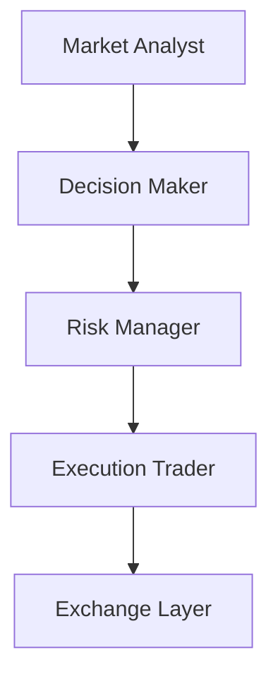

# 🏗️ Architettura

MDK Crypto Trading è progettato come un sistema multi-agente per il trading crypto spot.
L'MVP separa chiaramente analisi, decisione, controllo del rischio ed esecuzione, in modo da evitare che un singolo componente faccia tutto da solo.

## Flusso operativo MVP

## Ruoli degli agenti

### Market Analyst

- Riceve lo snapshot di mercato completo (prezzo, volume, order book, candele, indicatori tecnici).
- Invia i dati a GPT-5.4 che produce un'analisi strutturata (`MarketAnalysis`).
- Non decide direttamente l'operazione.
- Modello LLM e parametri configurati in `config/llm_models/market_analyst.yaml`.
- Prompt operativo in `config/prompts/market_analyst.md`.

### Decision Maker

- Riceve l'analisi del `Market Analyst`, il portafoglio, i vincoli operativi, la memoria IA e le performance recenti.
- Invia i dati a GPT-5.4 che produce una proposta operativa strutturata (`TradeProposal`).
- Azioni possibili: `BUY`, `SELL`, `HOLD`, `CANCEL_AND_REPLACE_ORDER`.
- Non esegue ordini reali.
- Modello LLM e parametri configurati in `config/llm_models/decision_maker.yaml`.
- Prompt operativo in `config/prompts/decision_maker.md`.

### Risk Manager

- Riceve la proposta del `Decision Maker`, il portafoglio, un sottoinsieme dell'analisi di mercato (`market_bias`, `summary`, `risk_notes`), i vincoli operativi e il prezzo corrente.
- Invia i dati a Gemini 3.1 Pro che produce una valutazione strutturata (`RiskAssessment`).
- Decisioni possibili: `APPROVE`, `BLOCK`, `REQUEST_ADJUSTMENT`.
- Non decide la strategia e non esegue ordini.
- Modello LLM e parametri configurati in `config/llm_models/risk_manager.yaml`.
- Prompt operativo in `config/prompts/risk_manager.md`.

### Execution Trader

- Riceve la proposta del `Decision Maker` e l'esito del `Risk Manager`.
- Non usa LLM: esegue ordini direttamente su Binance tramite `BaseExchangeClient`.
- Se la proposta non è approvata o è `HOLD` → `NOT_EXECUTED`.
- Per `BUY`/`SELL` → chiama `place_market_order` o `place_limit_order`.
- Per `CANCEL_AND_REPLACE_ORDER` → chiama `cancel_order` + `place_limit_order`.
- Se l'exchange lancia un'eccezione → `FAILED`.
- Non rivaluta strategia o rischio.

## Strati principali

### `src/agents/`

Contiene i 4 agenti dell'MVP e una base comune (`BaseAgent`).
Ogni agente espone un input strutturato e un output strutturato.

Tutti e 4 gli agenti sono implementati. `MarketAnalystAgent`, `DecisionMakerAgent` e `RiskManagerAgent` ricevono un `BaseLlmInterface`, leggono il prompt da disco, inviano i dati al modello e parsano la risposta JSON nei rispettivi contratti (`MarketAnalysis`, `TradeProposal` e `RiskAssessment`). `ExecutionTraderAgent` non usa LLM: riceve un `BaseExchangeClient` e piazza gli ordini direttamente sull'exchange.

### `src/core/`

- `contracts.py`: strutture dati condivise tra agenti (input, output, enum)
- `workflow.py`: catena lineare Market Analyst → Decision Maker → Risk Manager → Execution Trader
- `runner.py`: loop operativo ciclico con gestione errori e shutdown pulito

### `src/integrations/`

- `llm_interfaces/`: interfaccia astratta (`BaseLlmInterface`) e implementazioni per OpenAI (`OpenAiInterface`) e Gemini (`GeminiInterface`), con retry automatico via `tenacity`. Supportano `temperature` e `max_tokens` configurabili.
- `exchange/`: interfaccia astratta (`BaseExchangeClient`) e implementazione per Binance (`BinanceClient`), con supporto modalità DEMO e REAL.

`BinanceClient` espone:

- `ping()` / `get_account_info()`: verifica connessione e autenticazione
- `get_market_snapshot(symbol)`: raccoglie prezzo, volume, order book, trade recenti, candele multi-timeframe e calcola indicatori tecnici (RSI, EMA, SMA, MACD)
- `get_portfolio_state(symbol)`: raccoglie saldi USDC e coin, ordini aperti, ultimi trade
- `place_market_order(symbol, side, quantity)`: piazza un ordine a mercato
- `place_limit_order(symbol, side, quantity, price)`: piazza un ordine limit GTC
- `cancel_order(symbol, order_id)`: cancella un ordine aperto

### `src/utils/`

- `config.py`: caricamento variabili d'ambiente (`.env`) e file YAML (`trading.yaml`, `symbols.yaml`, configurazioni LLM)
- `indicators.py`: funzioni pure per il calcolo di RSI, EMA, SMA, MACD da una serie di prezzi di chiusura
- `logging_config.py`: logging su console (Rich) e su file con rotazione automatica (5 MB, 5 backup)
- `event_logger.py`: log JSON strutturato per le decisioni di ogni ciclo operativo

Per i dettagli completi sul sistema di logging, vedi `docs/observability.md`.

## Contratti condivisi

Per l'MVP ogni passaggio tra agenti usa strutture dati esplicite.
Questo evita JSON incoerenti sparsi nel codice e rende più facili test, logging e manutenzione.

I contratti principali sono:

- `MarketDataSnapshot`: dati di mercato (prezzo, volume, order book, candele, indicatori)
- `PortfolioState`: saldi, ordini aperti, ultimi trade
- `MarketAnalysis`: output del `Market Analyst`
- `TradeProposal`: output del `Decision Maker`
- `RiskAssessment`: output del `Risk Manager`
- `ExecutionReport`: output del `Execution Trader`
- `TradingCycleInput` / `TradingCycleResult`: input e output del ciclo completo

## Orchestrazione

Il ciclo operativo è gestito da due componenti complementari:

- **`TradingWorkflow`** (`workflow.py`): esegue la catena di agenti in sequenza
- **`TradingRunner`** (`runner.py`): loop infinito che ad ogni iterazione raccoglie dati dall'exchange, esegue il workflow e logga il risultato

Il runner:

1. Logga l'avvio e lo stato del kill switch
2. Ad ogni iterazione: raccoglie dati da Binance → costruisce `TradingCycleInput` → esegue il workflow → logga il risultato
3. In caso di errore: logga l'eccezione, registra l'evento e continua
4. Su `Ctrl+C`: termina in modo pulito

Il punto di ingresso è `src/main.py`, che fa il bootstrap di tutti i componenti (settings, LLM, exchange client, agenti, workflow, runner) e avvia il loop.

## Configurazione e prompt

- I prompt di lavoro degli agenti vivono in `config/prompts/`.
- I file in `dev_support/prompts/` restano la base di progettazione e riferimento umano.
- Le configurazioni dei modelli LLM (provider, model, temperature, max_tokens) vivono in `config/llm_models/`.
- Il simbolo di trading attivo è in `config/symbols.yaml`.
- Le regole operative (es. `min_order_usdc`) vivono in `config/trading.yaml`.
- I segreti (API key, URL, modalità) vivono nel `.env`.

Per i dettagli, vedi `docs/config.md`.
