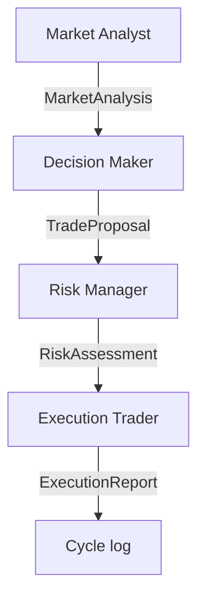

# Decision Logic

Describes MDK Crypto Trading's decision logic: what each agent does, how decisions pass from one to the next, and how errors and edge cases are handled.

---

## 📋 Table of Contents

- [Decision flow](#decision-flow)
- [Market Analyst](#market-analyst)
- [Decision Maker](#decision-maker)
- [Risk Manager](#risk-manager)
- [Execution Trader](#execution-trader)
- [Kill switch](#kill-switch)
- [LLM error normalization and retry](#llm-error-normalization-and-retry)
- [📚 References](#-references)

---

## Decision flow

Every operational cycle follows a linear chain of 4 steps. Each agent receives the previous one's output and produces a structured output for the next one.

### Automatic breakeven (deterministic)

Before the pre-check and the LLM chain, the runner executes `PositionManager.maybe_apply_breakeven`. If `unrealized_pnl_pct >= breakeven_trigger_pct` (configurable in `config/trading.yaml`, default `2.0%`) and there is an active OCO with the SL still below the entry price, the runner:

1. Cancels the existing OCO via `cancel_oco(symbol, orderListId)`
2. Places a new OCO with the same TP and the SL trigger = `avg_entry_price`
3. Reloads `portfolio.open_orders` with fresh data from Binance

The mechanism is silent: if a condition is not met or an error occurs, a WARNING is logged and the cycle proceeds normally without involving the Decision Maker. The mechanism is skipped entirely when the kill switch is active (`KILL_SWITCH=1`).

### Deterministic pre-check (optional)

Before the agent chain, the runner can apply a deterministic pre-check (zero LLM) that compares the current context with the previous cycle's snapshot: if price, RSI, MACD sign and the set of open orders remain within tolerance thresholds and the last action was `HOLD`, the cycle is skipped without calling any agent. The skip is configurable via `config/cycle_skip.yaml` (see `docs/config.md`) and turns off after `max_consecutive_skips` consecutive skips to ensure the Decision Maker periodically re-evaluates the setup anyway. Skipped cycles are recorded in `logs/events/` with `cycle_type: "skipped"`.

---

## Market Analyst

Analyzes market data and produces a signal. Does not decide trades.

- **Output**: `market_bias` (BULLISH / BEARISH / NEUTRAL), `signal_strength`, `confidence`, `suggested_action` (LONG_BIAS / SHORT_BIAS / NO_TRADE_BIAS)
- If the data is insufficient or contradictory → NEUTRAL signal
- Receives technical indicators (RSI, EMA 21, SMA 50, MACD, **ATR 14**) at both the current and previous value. ATR measures the average volatility of the last 14 hourly candles in USDC: rising ATR → increasing volatility (widen stops, reduce size); falling ATR → market compression (a breakout may be imminent).
- Receives multi-timeframe candles: 2h (12), 4h (50, ~8 days), 1d (30, ~1 month), 1w (8), 1M (6).

---

## Decision Maker

Receives the Market Analyst's signal and formulates a trade proposal using the **investment mandate** defined in `config/trading.yaml` as its compass. Runs on Claude Opus 5 with adaptive thinking (`thinking_effort: medium`): the model performs internal structured reasoning before emitting the JSON proposal.

- **Possible actions**: `BUY`, `SELL`, `SELL_OCO`, `HOLD`, `CANCEL_AND_REPLACE_ORDER`
- **Order types**: `MARKET`, `LIMIT`, `NONE` (HOLD only)
- Uses the mandate (maximum drawdown, horizon, maximum position) as risk constraints and strategic context. The goal of generating a return on capital is part of the DM's identity and is defined in the prompt.
- Explicitly evaluates memory (`decision_memory`) and performance (`performance_summary`, `recent_performance`) **before** deciding: a sequence of `HOLD`s in a non-stagnant market is a sign of hesitation.
- Receives `avg_entry_price`, `unrealized_pnl_pct` and `unrealized_pnl_usdc` directly in `PortfolioState`: the runner computes them on every cycle using the FIFO method over the still-open BUY lots. The DM uses them as a concrete reference for exit decisions: if `unrealized_pnl_pct` is positive, it evaluates whether to take a partial profit instead of accumulating further; if it is negative, it evaluates whether adding new tranches is justified by the setup or whether it is averaging down without reason. `unrealized_pnl_usdc` expresses the same P&L in absolute USDC value, computed on the quantity **tracked by the FIFO** (`open_qty`) and not on the exchange's total balance: coins not tracked by the bot's memory have an unknown cost basis and are not included. The DM **must not compute the P&L on its own**: if both fields are `None`, there is no trackable position. All three fields are `None` if there is no open position.
- Receives `current_price` as an explicit field in `DecisionMakerInput` (propagated from `market_data.price` by the workflow). It uses this to estimate the notional value of orders (`quantity × current_price`) and verify it respects `max_order_notional_usdc` before proposing — eliminating cycles wasted on Risk Manager corrections.
- Receives `oco_review_required`: a boolean flag computed deterministically by the runner. Becomes `True` when an OCO order has been open for more than `oco_review_interval_hours` (configurable in `config/trading.yaml`, default 24h). When `True`, the prompt requires an explicit evaluation of the TP/SL levels in the `reason`: the DM can confirm their validity or propose `CANCEL_AND_REPLACE_ORDER`, but a silent HOLD is not allowed.
- Also receives `latest_performance_review`: the `Performance Reviewer`'s daily report with an assessment of mandate adherence (`ALIGNED`, `DRIFTING`, `MISALIGNED`) and 1-3 concrete suggestions. If the Reviewer flags `DRIFTING` or `MISALIGNED`, the suggestions must be actively incorporated into the decision.
- Also receives `latest_news_review`: the `News Reviewer`'s latest digest (updated every 12h), containing overall sentiment (`BULLISH`/`BEARISH`/`NEUTRAL`), a summary of relevant events and risk flags. It should be weighed as **macro context**, not as an automatic order: the primary signal remains the Market Analyst's technical analysis. `risk_flags` deserve particular attention as they signal possible volatility shocks. The field is empty if the Alpha Vantage key is not configured or the first report has not yet been generated.
- When in doubt, it leans toward the action consistent with the mandate, not toward a default `HOLD`. `HOLD` remains legitimate when the market is stagnant or risks are concrete.
- Can use **fractional quantities** relative to the portfolio: it is not required to use the entire USDC balance or always sell the entire position.
- **Scaling in**: when a setup is clear but it wants to reduce timing risk, it can split the entry into 2-3 tranches (first tranche `MARKET BUY`, subsequent ones `LIMIT BUY` at lower prices).
- **Partial take profits**: when the price has risen significantly from entry, it can place a `LIMIT SELL` above the current price with a partial `quantity` to monetize part of the position while letting the rest run. Any TP updates in subsequent cycles go through `CANCEL_AND_REPLACE_ORDER`.
- **OCO (One Cancels Other)**: with `SELL_OCO`, the DM can pair a Take Profit (`price`, above the current price) and a Stop Loss (`sl_stop_price`, below the current price) on the same quantity in a single operation. When one of the two triggers, Binance automatically cancels the other. To be used when there is an open position and no SELL order already active on the pair.
- If the DM sees concrete downside risk without wanting to use OCO, it must do a `MARKET SELL` (full or partial) — not a `LIMIT SELL` below market, which would be executed immediately.
- Does not propose orders below `min_order_usdc`.
- Does not propose duplicate orders if there are already open orders on the same pair.
- Every order in `open_orders` exposes `age_hours`: hours elapsed since creation. The DM uses this to assess whether a `LIMIT` order that has been standing too long should be updated via `CANCEL_AND_REPLACE_ORDER` or cancelled.

---

## Risk Manager

Evaluates the Decision Maker's proposal against risk constraints.

- **Possible outcomes**: `APPROVE`, `BLOCK`, `REQUEST_ADJUSTMENT`
- `APPROVE`: proposal valid and consistent with the constraints
- `BLOCK`: proposal dangerous, impossible or inconsistent
- `REQUEST_ADJUSTMENT`: valid idea but details need correcting
- Checks: sufficient balance, available quantity, order above the minimum, no conflicting order

---

## Execution Trader

Executes the proposal if approved. No strategic decisions.

- If `risk_decision` is not `APPROVE` → does not execute
- If the action is `HOLD` → does not execute
- Before executing any order, applies deterministic guardrails: blocks orders with invalid quantity or price, orders whose notional is **below `min_order_usdc`** (minimum guardrail) or **above `max_order_notional_usdc`** (maximum guardrail), orders that exceed `max_position_pct` of the total portfolio, and `CANCEL_AND_REPLACE_ORDER` with an `order_id` not present among the open orders. In all these cases it returns `NOT_EXECUTED` with a tracked reason, without calling the exchange.
- If `CANCEL_AND_REPLACE_ORDER` → cancels the old order, then places the new one. If the cancellation succeeds but the replacement fails, the report is `FAILED` with the `unprotected_position=True` flag: the runner intercepts this flag and sends a dedicated Telegram alert (`[ALARM] UNPROTECTED POSITION`), requiring immediate manual intervention.
- If `SELL_OCO` → places a SELL OCO on Binance (Take Profit LIMIT + Stop Loss STOP_LOSS_LIMIT paired)
- If execution fails → flags `FAILED` in the report

---

## Performance Reviewer

Advisory agent outside the decision chain. Runs **once a day**, at the start of the first cycle of the day for which a report does not already exist in `data/performance_reports/`.

- The runner calls `PerformanceReviewRunner.maybe_run_today()` at the start of the cycle: if the `YYYY-MM-DD.md` file already exists for today, it returns immediately at no cost.
- Otherwise:
  1. `load_recent_events` reads the JSONL logs of the last 7 days filtered by symbol.
  2. `build_performance_stats` computes **deterministic** statistics (zero LLM): `total_cycles`, `hold_ratio`, `strong_bullish_ignored`, `sell_failed`, `realized_pnl_usdc`, `days_without_executed_trade`, `sells_in_profit`, `sells_in_loss` (counters of the last 10 FIFO SELLs closed in profit/loss), etc.
  3. `PerformanceReviewerAgent` (Claude Sonnet 5) receives the stats + the mandate and produces a `PerformanceReview`: a concise summary, `mandate_adherence` (`ALIGNED` / `DRIFTING` / `MISALIGNED`) and 1-3 concrete suggestions. The definition of `DRIFTING` is balanced between entries and exits: a high `strong_bullish_ignored` alone is not enough if the system already has a profitable position; it also applies if `sells_in_loss > sells_in_profit` with significant activity, or if BUYs have accumulated with no realized SELL. The suggestions cover both entry and exit management (take profit, stop loss, use of `SELL_OCO`).
  4. The result is serialized to markdown in `data/performance_reports/YYYY-MM-DD.md`.
- In subsequent cycles, `PerformanceReviewRunner.load_latest_review()` reads the most recent file and passes it to the Decision Maker as a string (`latest_performance_review`).
- **Errors do not block the cycle**: if the Reviewer fails (LLM down, stats not computable, etc.), a warning is logged and the DM receives an empty string as a fallback.

---

## Kill switch

If `KILL_SWITCH=1` in `.env`, no write reaches the exchange: the Execution Trader blocks any order and returns `NOT_EXECUTED`, and the automatic breakeven (`PositionManager.maybe_apply_breakeven`) is skipped without touching active OCOs. The rest of the chain runs normally (analysis, decision, risk check) and market/portfolio reads remain active: they only observe, they do not change anything.

---

## LLM error normalization and retry

The system handles LLM errors on two distinct levels.

**Level 1 — API retry (tenacity, in the LLM interfaces):**
Each LLM interface automatically retries API calls on temporary provider errors, with exponential backoff (max 3 attempts):

- `AnthropicInterface`: `RateLimitError`, `APIConnectionError`, `APITimeoutError`, `InternalServerError`, `OverloadedError` (respectively: 429, connection errors, timeout, 500, 529)
- `OpenAiInterface`: `RateLimitError`, `APIConnectionError`, `APITimeoutError`, `InternalServerError`
- `GeminiInterface`: `ServerError`

**Level 2 — parsing retry (`BaseLlmAgent._call_llm_with_retry`):**
Before validating the JSON response, the system normalizes it via `unwrap_llm_response()`. This handles cases where the model returns correct JSON but wrapped in an array (e.g. `[{...}]` instead of `{...}`), or responds with an empty dict or an unexpected type.

The LLM interfaces detect problematic responses early and raise `RuntimeError` in the following cases:

- empty or `None` response from the provider
- JSON response decoded into an empty dict `{}`
- response not decodable as JSON (with a WARNING log of the raw response)

The entire operation — model call, normalization and parsing — is wrapped in a `try/except` block that catches `ValueError`, `KeyError`, `TypeError` and `RuntimeError`. If something goes wrong, the system automatically retries up to a maximum of 4 attempts. On every failed attempt, a WARNING is emitted with the error detail and the model's raw response. If all 4 attempts fail, the cycle is marked as an error and the system moves on to the next cycle.

---

## 📚 References

- **Code**:
  - `src/core/contracts.py` — shared data structures (MarketAnalysis, TradeProposal, RiskAssessment, ExecutionReport, InvestmentMandate)
  - `src/core/workflow.py` — agent chain orchestration
  - `src/agents/` — the 4 agents' implementation
  - `src/utils/config.py` — `load_mandate` loads and validates the mandate from `config/trading.yaml`
- **Related docs**: `docs/architecture.md`, `docs/hierarchy_and_roles.md`
