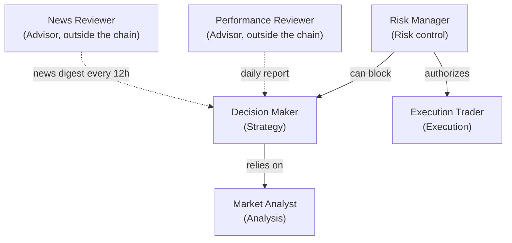

# Hierarchy and Roles

MDK Crypto Trading is structured like an investment firm. Each agent has a level of authority and a precise role in the decision chain.

---

## 📋 Table of Contents

- [Authority hierarchy](#authority-hierarchy)
- [Fundamental rule](#fundamental-rule)
- [📚 References](#-references)

---

## Authority hierarchy

| Level | Agent                    | Role                          | Authority                                                                                                                                                                                                                        |
|-------|--------------------------|-------------------------------|----------------------------------------------------------------------------------------------------------------------------------------------------------------------------------------------------------------------------------|
| 1     | **Risk Manager**         | Chief Risk Officer            | Has veto power: can approve, block or request changes to any proposal. No order goes through without its authorization.                                                                                                          |
| 2     | **Decision Maker**       | Portfolio Manager             | Decides the operational strategy (BUY, SELL, SELL_OCO, HOLD, CANCEL_AND_REPLACE_ORDER), but its proposals are always subject to the Risk Manager's judgment.                                                                     |
| 3     | **Market Analyst**       | Research Analyst              | Provides market analysis and signals. Has no decision-making power: its output is an input for the Decision Maker.                                                                                                               |
| 4     | **Execution Trader**     | Broker                        | Executes orders on Binance, but only if authorized by the Risk Manager. Makes no autonomous decisions.                                                                                                                           |
| —     | **Performance Reviewer** | Advisory Performance Auditor  | Advisory role, outside the decision chain. Produces a daily assessment of recent performance read by the Decision Maker in subsequent cycles. Does not take part in individual trade decisions and has no veto power.            |
| —     | **News Reviewer**        | Advisory Market Intelligence  | Advisory role, outside the decision chain. Produces a news digest every 12h (sentiment, events, risk flags) read by the Decision Maker as macro context. Does not take part in individual trade decisions and has no veto power. |

---

## Fundamental rule

No order is executed without the Risk Manager's explicit approval (`APPROVE`). Even if the Decision Maker proposes a trade with high confidence, the Risk Manager can block it at any time.

The `Performance Reviewer` and the `News Reviewer` are deliberately **outside** this hierarchy: they are advisors that produce periodic reports without touching the real-time decision chain. Their outputs are informational inputs for the Decision Maker, not operational constraints. Both are non-blocking: if they fail, the cycle proceeds normally.

---

## 📚 References

- **Code**: `src/agents/` — implementation of the 5 agents
- **Related docs**: `docs/architecture.md`, `docs/decision_logic.md`
