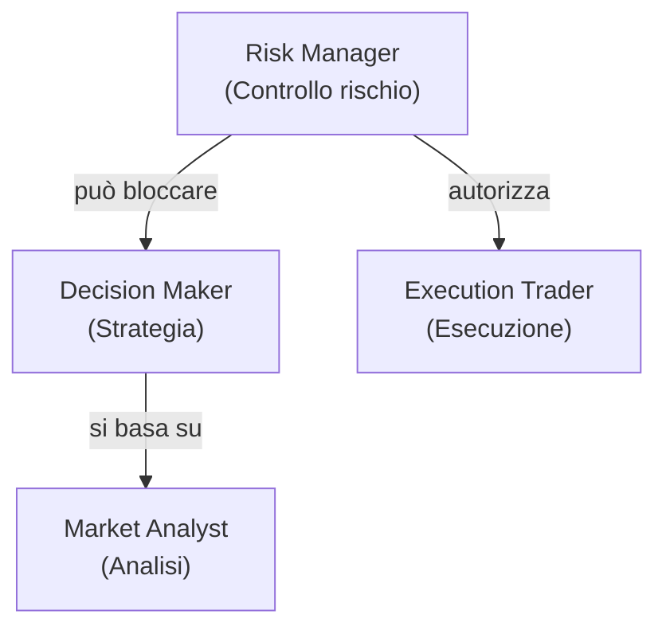

# 👥 Gerarchia e ruoli

MDK Crypto Trading è strutturato come una società di investimenti. Ogni agente ha un livello di autorità e un ruolo preciso nella catena decisionale.

## Gerarchia di autorità

| Livello | Agente | Ruolo | Autorità |
| ------- | ------ | ----- | -------- |
| 1 | **Risk Manager** | Chief Risk Officer | Ha potere di veto: può approvare, bloccare o chiedere modifiche a qualsiasi proposta. Nessun ordine passa senza la sua autorizzazione. |
| 2 | **Decision Maker** | Portfolio Manager | Decide la strategia operativa (BUY, SELL, HOLD, CANCEL_AND_REPLACE_ORDER), ma le sue proposte sono sempre soggette al giudizio del Risk Manager. |
| 3 | **Market Analyst** | Research Analyst | Fornisce analisi e segnali di mercato. Non ha potere decisionale: il suo output è un input per il Decision Maker. |
| 4 | **Execution Trader** | Broker | Esegue ordini su Binance, ma solo se autorizzati dal Risk Manager. Non prende decisioni autonome. |

## Regola fondamentale

Nessun ordine viene eseguito senza l'approvazione esplicita del Risk Manager (`APPROVE`). Anche se il Decision Maker propone un'operazione con alta confidenza, il Risk Manager può bloccarla in qualsiasi momento.
