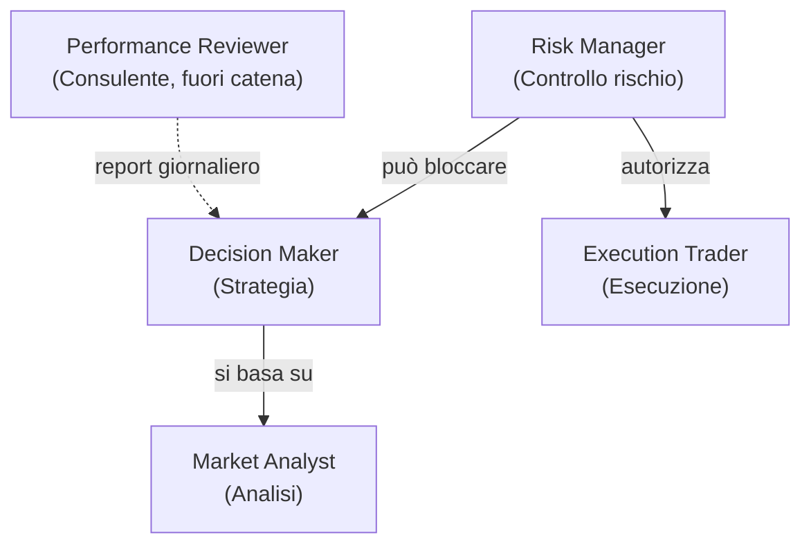

# Gerarchia e ruoli

MDK Crypto Trading è strutturato come una società di investimenti. Ogni agente ha un livello di autorità e un ruolo preciso nella catena decisionale.

---

## 📋 Indice

- [Gerarchia di autorità](#gerarchia-di-autorità)
- [Regola fondamentale](#regola-fondamentale)
- [📚 Riferimenti](#-riferimenti)

---

## Gerarchia di autorità

| Livello | Agente                   | Ruolo                         | Autorità                                                                                                                                         |
|---------|--------------------------|-------------------------------|--------------------------------------------------------------------------------------------------------------------------------------------------|
| 1       | **Risk Manager**         | Chief Risk Officer            | Ha potere di veto: può approvare, bloccare o chiedere modifiche a qualsiasi proposta. Nessun ordine passa senza la sua autorizzazione.           |
| 2       | **Decision Maker**       | Portfolio Manager             | Decide la strategia operativa (BUY, SELL, HOLD, CANCEL_AND_REPLACE_ORDER), ma le sue proposte sono sempre soggette al giudizio del Risk Manager. |
| 3       | **Market Analyst**       | Research Analyst              | Fornisce analisi e segnali di mercato. Non ha potere decisionale: il suo output è un input per il Decision Maker.                                |
| 4       | **Execution Trader**     | Broker                        | Esegue ordini su Binance, ma solo se autorizzati dal Risk Manager. Non prende decisioni autonome.                                                |
| —       | **Performance Reviewer** | Performance Auditor consulente | Ruolo consultivo, fuori dalla catena decisionale. Produce un giudizio giornaliero sulle performance recenti letto dal Decision Maker nei cicli successivi. Non partecipa alla decisione del singolo trade e non ha potere di veto. |

---

## Regola fondamentale

Nessun ordine viene eseguito senza l'approvazione esplicita del Risk Manager (`APPROVE`). Anche se il Decision Maker propone un'operazione con alta confidenza, il Risk Manager può bloccarla in qualsiasi momento.

Il Performance Reviewer sta deliberatamente **fuori** da questa gerarchia: è un consulente che osserva i dati storici e scrive un report, senza toccare la catena decisionale in tempo reale. Il suo output è un input informativo per il Decision Maker, non un vincolo operativo.

---

## 📚 Riferimenti

- **Codice**: `src/agents/` — implementazione dei 5 agenti
- **Doc correlati**: `docs/architecture.md`, `docs/decision_logic.md`
