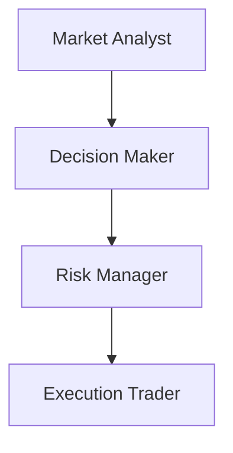

# 👥 Gerarchia e ruoli

- `Market Analyst`: analizza il mercato e produce un segnale strutturato.
- `Decision Maker`: trasforma il segnale in una proposta operativa.
- `Risk Manager`: controlla la proposta e puo' approvarla, bloccarla o richiedere modifiche.
- `Execution Trader`: esegue solo proposte approvate.
